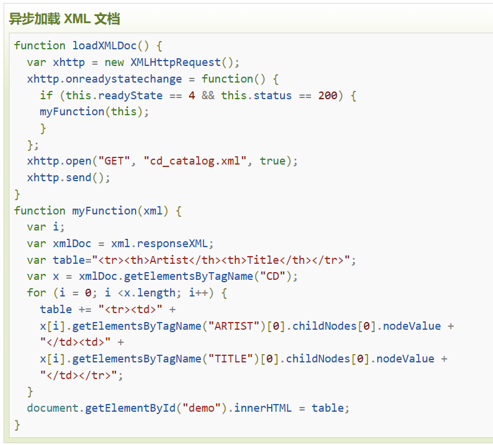

# 第二轮考核 
## 基础要求

- 2.2.2 √换一换 随机排序
- 2.2.3 √重磅热播 tab 栏目切换
- 2.2.5 √小视频 hover 更换介绍文字 
        ×海报背景颜色随海报颜色 更换 鼠标悬停播放视频
        ×左上角与右下角的介绍 电视剧显示集数 电影显示评分 **303接口**
- 2.2.6 √搜索 热搜 接口 **304接口**
- 2.2.7-1  √视频详情页简介
- 2.2.7-2  √选集 电视剧 **301 302 接口** 电视剧 电影 区分
- 2.3.6 ×弹幕 讨论  **弹幕文件夹**

## 进阶要求
- √实现用户登录 **101接口**
- √登录 **102接口**
- √登出 **103接口**
- ×搜索框历史记录 **保存本地**
- ×丰富讨论区功能 **评论文件夹**
- ×自定义视频播放器
- ×保存观看进度 **306接口**

---


> ### 开发日志
```
- 4月5日 学习 JavaScript Web API 部分 完成 视频详情页的视频简介鼠标点击呼出功能
- 4月9日 使用if else语句完成登录窗口 用户是否同意登录政策
- 4月10日 try to achieve register function...but no response... [CORS跨域问题]
- 4月23日 重做首页和视频详细页
``` 

- ### 布局问题
  **remake-index已解决**50%缩放下 顶部导航栏图标均存在问题
  
  **remake-index已解决**各种缩放下均存在问题需要解决，左右两侧箭头，以及与视频的相对位置 
  
  **remake-index已解决** hover头像布局问题 
  **remake-index已解决**下拉菜单hover效果存在bug，hover盒子位置错误
    
  **remake-index已解决**!!背景视频链接有bug，不能完全覆盖视频(初始布局知识不全面出现的bug)(其他div遮挡造成的)

> ### 学习笔记

- ##### JavaScript
  基本语法 
  1 "变量" var let -name- = -value- ;
  2 "函数" function () { } 
  3 递归 循环 
  4 **JavaScript 箭头函数**
  ```
  箭头函数语法
  支持 async 
   () => expression 当只有一个简单参数时可以忽略括号
   () => {
    statements  多行代码不可省略大括号
   }
   相当于 (function (a) {
    return expression;
   })
  ```

  x.addEventListener("click",-functionName-); **鼠标点击事件监听**
  .offsetLeft .offsetWidth .OffsetHeight .OffsetTop; **获取位置偏移量以及元素大小 数值没有单位 不可赋值**
  **style只能获取行内样式表的样式值**
  <br>

  ==  双等号只检查变量的值 **等于**
  === 严格相等（也称为三重相等运算符）检查变量的值及其数据类型 **严格等于 区别于c++**

  基础知识
   -创建一条消息

  x.style.opacity
  x.style.maginLeft **区别于css的margin-left**

  ##### 细节
  部分图片没有完善
  

- ##### APIfox
  Mock **方便进行调试**

- ##### ES6
  1.需要在node.js环境下运行

  2.es6 的 Promising
    promise的状态只能从 未完成->完成, 未完成->失败 且状态不可逆转
  3.es6 的 JSON数组形式转换成数组Array及其其他伪数组 （实例：搜索历史本地记录）
    ```
    JSON 数组格式转换成数组  Array.from(xxx)
    let json = {
        '0': 'a',
        '1': 'b',
        '2': 'c',
        length:3
    }
    let arr=Array.from(json);
    console.log(arr) // ['a','b','c']
    ```
    ```
    文本或者变量转换成数组 Array.of(xxx)
    let arr =Array.of(3,4,5,6);
    console.log(arr); // [3,4,5,6]
    let arr =Array.of('a','b','c');
    console.log(arr); // ['a','b','c']
    ```

- ##### ajax 
    ajax=JavaScript + 异步
    多用于快速修改网页内容的一种新的使用现有标准的方法
    
    function loadXMLDoc()   **创建XMLHttpRequest对象
{
    .... AJAX 脚本执行 ...
}

  XML 被设计用来传输和存储数据
  HTML区别于 HTML都是预定义标签
  
    如需将请求发送到服务器，我们使用 XMLHttpRequest 对象 的 open() 和 send() 方法
    向服务器交换数据
    xmlhttp.open("GET","ajax_info.text",true);
    xmlhttp.send();

    loadXMLDoc() 函数 **可用于获取用户收藏列表**
    

    **输入用户名密码检测非法字符的正则表达式**
    
    

    **正则表达式扩展**
    

**但如今 XML已经被JSON替代**

  AJAX 可以无需刷新页面与服务器通信
  但是没有浏览历史，不能回退
  SEO （爬虫）不友好
 
  **传输均使用HTTP协议**

  HTTP协议详细规定了浏览器和万维网服务器之间的通信规则

  **cors**
  设置origin
  
  **Response.type: 只读，表示响应的类型**
  - opaque : 对模式为no-cors的跨源响应 Response.status为0，Response.headers为空，Response.body为null。这并不表示响应发生了错误，因为即使响应的状态码是200，Response.status也依旧是0。换句话说，opaque响应只对JavaScript不透明（而对浏览器可见），JavaScript无法读取其内部信息。
  - cors：表示对一个有效跨源请求的响应，可访问的首部受CORS限制。
  - basic：表示同源响应，除Set-Cookie和Set-Cookie2（Forbidden response header name[7]）外，所有首部均可访问。

  ##### 请求报文 
                      格式与参数
  ```  
  行  GET请求类型 /url(s?ie=utf-8) HTTP/1.1 
  头  Host : atguigu.com,
      Cookie :  name=guigu,
      Content-type: application/x-www-form-urlencoded,
      User-Agrnt : chrome 83,
      mode: no-cors,  //重要 
  空行
  体  username=admin&password=admin
  ``` 

##### 响应报文

```
行  HTTP/1.1 200 OK
头  Content-Type: text/html,charset=utf=8
    Content-length : 2048
    Content-encodeing: gzip
空行
体  <html>
      <head>
      </head>
      <body>
          <h1>...<h1>
      </body>
      </html>
```
  #### JSON
  json是JavaScript对象语法格式
  json存储在自己的文件之中，后缀为.json

  #### CSS
- 完善媒体查询笔记
  屏幕 16:10 2560×1600px
  50% width 2560px
  67% widih 1920px
  75% width 1706px
  80% width 1600px
  90% width 1422px
  100% width 1280px
  110% width 1163px
  125% width 1024px
  150% width 853px
  个人信息页媒体查询 （较为成功的个人案例）
  
- grid布局
  position:absolute; 不会撑大grid网格 应用于JS按键响应的页面弹窗
   
##### JSONP
  对于 fetch() 与 xmlhttprequest,一般会出现 cors 跨域问题
  
##### 构造函数 Promise
  避免回调地狱所诞生 ES6的新的解决方案之一
  封装了异步的任务并且对结果处理的方法 

  基本语法结构 
  let promise = new Promise(resolve , reject) {
    if (...) {
      resolve(data); //请求成功调用
    }
    else {
      reject(data);
    }
  }
```
 Promise对象 属性 PromiseState 只读 有 padding resolved rejected 三种属性
```
```
 PromiseResult，保存着对象 成功/失败 的结果，也不能直接通过实例对象进行修改。能修改它的有三种方法：
 resolve()
 reject()
 抛出异常throw
```
**promise的状态只能由pending变为fulfilled 或者 由pending变为rejected,且状态改变之后不会再发生改变**

Promise构造方法传的是一个回调函数，回调函数里面也带着两个参数，
一个是resolve，请求成功之后的回调，第二个是reject，请求失败的回调

- then():属于构造函数原型里面的方法，通过实例化Promise去调用，返回promise对象，这也让promise可以进行链式调用，有两个参数。  
- catch()：也是属于构造函数原型里面的方法，指定错误的时候回调，这里相当于then()的第二个参数，所以一般不写then()的第二个参数，直接写调用catch(),由于then()返回的是promise对象，这里就可以在后面直接调用这个方法
- Promise.all()：是构造函数本身的一个方法，将多个promise实例对象包装成一个新实例，返回全部实例状态变更后的结果数组(全部变更再返回)
        - 参数：接受一个由promise对象组成的数组
        - 失败：其中一个实例状态变成rejected，最终状态就会变成rejected
        - 成功：只有全部实例状态变成fulfilled，最终返回状态才会变成fulfilled
- Promise.race()：将多个实例包装成一个新实例，返回全部实例状态优先变更后的结果(先变更先返回)

##### 本地存储
- localStorage
  ```
  不会被爬虫获取
  本质上是对字符串的读取，如果存储内容多的话会消耗内存空间，会导致页面变卡
  localStorage与sessionStorage的唯一一点区别就是localStorage属于永久性存储，而sessionStorage属于当会话结束的时候，sessionStorage中的键值对会被清空
  ```
- SessionStorage 
  ```
  浏览器关闭即失效
  ```

#### 数学公式
- 广告轮播图实例 
  ##### 第i张图片与按钮数列关系
  

  ```
  伪代码
  setTimeout(timer) {   自动轮播基本框架 每timer毫秒执行一次
    left = (i % count == 0) ? 0 : (-415 * (i % count -1) - 415);
    runAnimation(left);
    i++;
  }
  runAninaiton(left) {
    将marginLeft以动画形式设置为left
  }
  ```

  

#### 一些想法
- 接口305不能满足sizeof:12对所有的栏目直接进行全部换一换
  可以 用 sizeof:6 一直像接口发出请求 并 以set数组存储id 去重后，
  直到set length = 12 结束请求 再向301接口一个个发送set数组里的id 
  即相当于 sizeof：12（不采纳，解决方法：等待接口完善）
- 接口305不能满足对电影 电视剧类型的限制
  用 sizeof:6 一直向接口发出请求 对类型筛选后再 以set数组存储id 去重后
  直到set length = 12 结束请求 再向301接口一个个发送set数组里的id 
  即相当于 sizeof：12 type: movie （不采纳，解决方法：使用接口304）

#### HTML5 Video标签
  

#### CSS 计数器
- 1 首先使用counter-reset 创建它。
- 2 使用 content 和 counter-increment 等 显示计数器值和改变计数器值
- 
- 

#### Map的遍历与sort方法
读取写入方法 Map.get(key); Map.set(key,value);
初始化 var map = new Map(); //构造函数
map,set等数据结构转数组 [...map]  
- 
- 

#### 选项卡之间传递参数
- localStroage 
- Cookie
- 全局变量 windows.myGlobalId = id; var id = windows.myGlobalId;
- query传递 
  1.通过 URL 的查询字符串（即问号后面的参数）将参数传递给页面。可以通过location.search或URLSearchParams对象来获取和解析参数
  2.
  //传递参数
const params = {id: 123, name: 'Alice'};
const url = `http://example.com/page?${new URLSearchParams(params)}`;
window.location.href = url;
 
// 接收参数
const searchParams = new URLSearchParams(window.location.search);
const id = searchParams.get('id');
const name = searchParams.get('name');

#### 检测页面是否触底
- windowHeight 视界高度
  获取视界高度 var windowHeight = document.documentElement.clientHeight;
- scrollHeight 文档高度
  获取文档高度 var scrollHeight = document.documentElement.scrollHeight;
- scrollTop 滚动长度
  获取滚动长度 var scrollTop = document.documentElement.scrollTop;
当滚动长度加视界高度 + 5 >= 文档高度 视为触底

#### 请求头注意！

对于接口100，请求头的Content-Type需要特别设定，默认的Content-type否则出现报错
"Content type 'text/plain;charset=UTF-8' not supported"

#### addEventListener 事件侦听
- 右键 'contextmenu'
- 左键 'click'
- 鼠标移入 'mouseenter' 'mouseover' 全部元素 仅父元素 区别
- 鼠标移出 'mouseleave' 'mouseout' 
- 鼠标点击 'mousedown' 'mouseup'
- 鼠标移动 'mouseover'

#### 已知知识自制的简易弹幕系统
``` 
1.生成弹幕逻辑
[video][video][弹幕初始位置]
[video][video]
[video][video]
在弹幕初始位置生成x条弹幕
弹幕id == 用户ID 弹幕样式 2px solid white 以及 可用的 编辑删除弹幕功能
video.offsetWidth == 弹幕移动距离 (|marginLeft|) (负值)
相近时间（ i < happendTimeArray[x] < i + duration）发射的弹幕 top 递增
非相近时间 top = 0；//清零top 
```

```
2.生成弹幕
3.发射弹幕逻辑
如果video.currentTime 与 happendTimeArray[x] 相近 （video.currentTime -10 <= happendTimeArray[x]）
则发射第x条弹幕
弹幕动画，当 弹幕移动距离|marginLeft| > video.offsetWidth 样式display=none marginLeft清零
```

```
鼠标悬停，暂停弹幕动画
鼠标点击相应功能，暂停播放等待用户完成功能指引
```