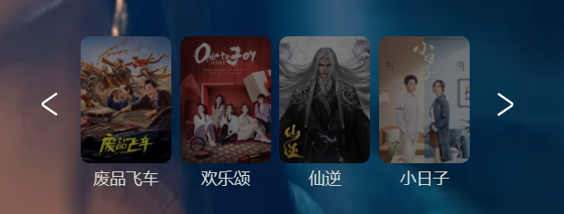
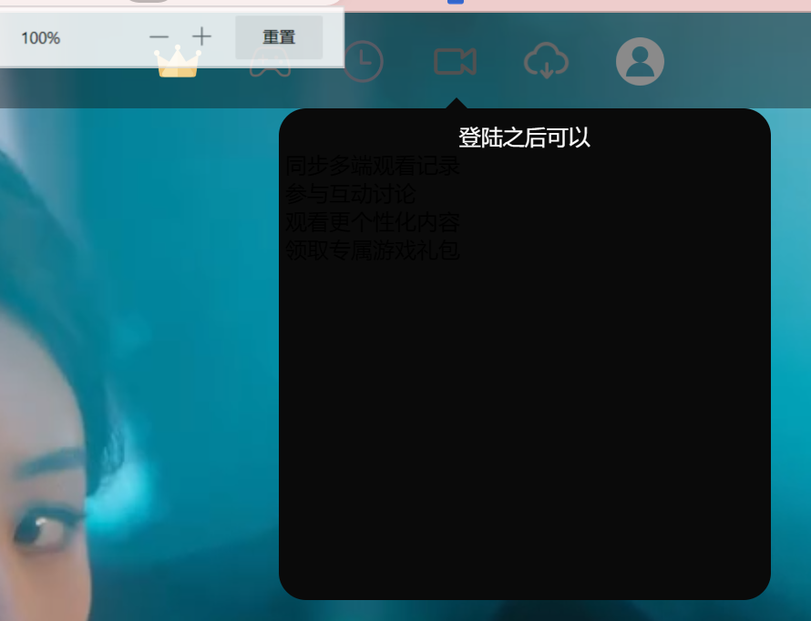
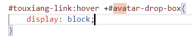
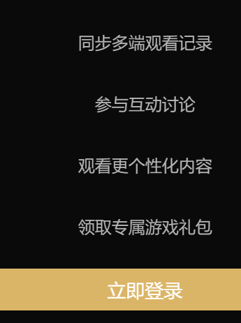
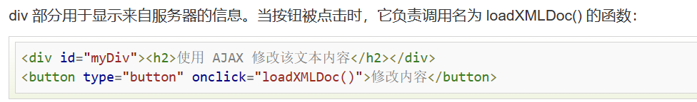
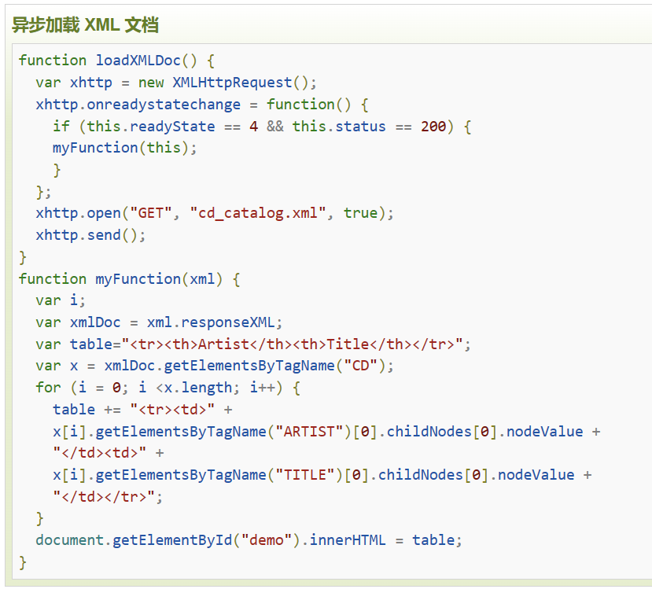

# 第二轮考核 
## 基础要求

- 2.2.2 ×换一换 随机排序
- 2.2.3 ×重磅热播 tab 栏目切换
- 2.2.5 ×小视频 hover 更换介绍文字 
        ×海报背景颜色随海报颜色更换 鼠标悬停播放视频
        ×左上角与右下角的介绍  **303接口**
- 2.2.6 ×搜索 热搜 接口 **304接口**
- 2.2.7-1  ×视频详情页简介
- 2.2.7-2  ×选集 电视剧 **301 302 接口** 电视剧 电影 区分
- 2.3.6 ×弹幕 讨论  **弹幕文件夹**

## 进阶要求
- ×实现用户登录 **101接口**
- ×登录 **102接口**
- ×登出 **103接口**
- ×搜索框历史记录 **保存本地**
- ×丰富讨论区功能 **评论文件夹**
- ×自定义视频播放器
- ×保存观看进度 **306接口**

---

> ### 开发日志

- 4月5日 学习 JavaScript Web API 部分 完成 视频详情页的视频简介鼠标点击呼出功能
- 4月9日 使用CSS JS-if else语句完成登录窗口 用户是否同意登录政策
- ###布局问题
  50%缩放下 顶部导航栏图标均存在问题
  
  各种缩放下均存在问题需要解决，左右两侧箭头，以及与视频的相对位置 
  **半解决** hover头像布局问题 
  **已解决**！！下拉菜单hover效果存在bug，hover盒子位置错误
    
  背景视频链接有bug，不能完全覆盖视频
> ### 学习笔记

- ##### JavaScript
  基本语法 
  1 "变量" var let -name- = -value- ;
  2 "函数" function () { } 
  3 递归 循环 
  **4 JavaScript 箭头函数**

  x.addEventListener("click",-functionName-); **鼠标点击事件监听**
  .offsetLeft .offsetWidth .OffsetHeight .OffsetTop; **获取位置偏移量以及元素大小 数值没有单位 不可赋值**
  **style只能获取行内样式表的样式值**
   

  ==  双等号只检查变量的值 **等于**
  === 严格相等（也称为三重相等运算符）检查变量的值及其数据类型 **严格等于 区别于c++**
  ##### 改变样式
  x.style.opacity
  x.style.maginLeft **区别于css的margin-left**
  ##### JSON
  json是JavaScript对象语法格式
  json存储在自己的文件之中，后缀为.json
  ##### 细节
  部分图片没有完善
  

- ##### APIfox
  Mock **方便进行调试**

- ##### ES6
  1.需要在node.js环境下运行

- ##### ajax
    ajax=JavaScript + 异步
    多用于快速修改网页内容的一种新的使用现有标准的方法
    
    function loadXMLDoc()   **创建XMLHttpRequest对象
{
    .... AJAX 脚本执行 ...
}

    向服务器交换数据
    xmlhttp.open("GET","ajax_info.text",true);
    xmlhttp.send();

    loadXMLDoc() 函数 **可用于获取用户收藏列表**
    
