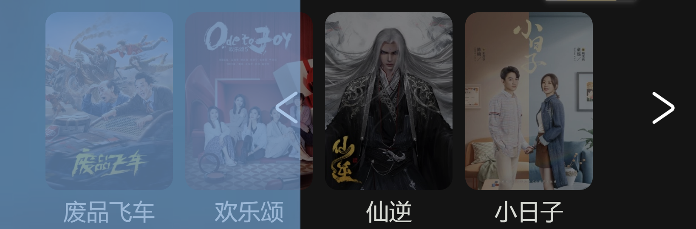
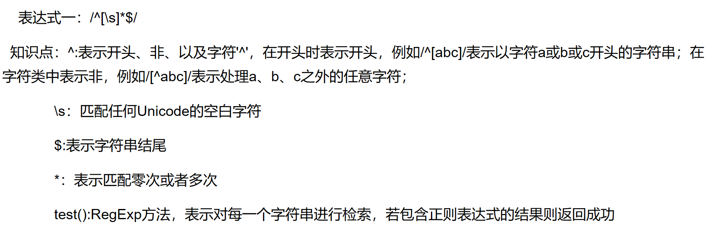
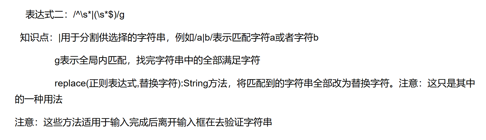
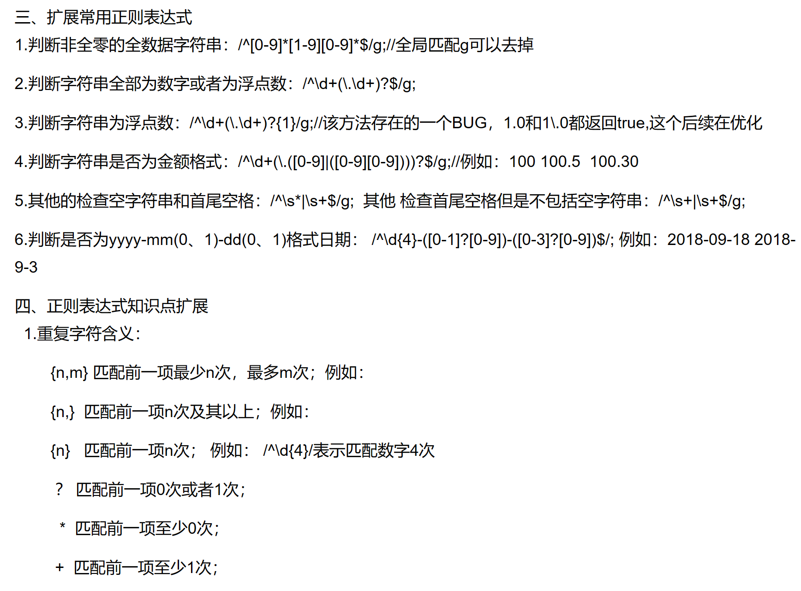

# 第二轮考核 
## 基础要求

- 2.2.2 ×换一换 随机排序
- 2.2.3 ×重磅热播 tab 栏目切换
- 2.2.5 ×小视频 hover 更换介绍文字 
        ×海报背景颜色随海报颜色更换 鼠标悬停播放视频
        ×左上角与右下角的介绍 电视剧显示集数 电影显示评分 **303接口**
- 2.2.6 ×搜索 热搜 接口 **304接口**
- 2.2.7-1  ×视频详情页简介
- 2.2.7-2  ×选集 电视剧 **301 302 接口** 电视剧 电影 区分
- 2.3.6 ×弹幕 讨论  **弹幕文件夹**

## 进阶要求
- ×实现用户登录 **101接口**
- ×登录 **102接口**
- ×登出 **103接口**
- ×搜索框历史记录 **保存本地**
- ×丰富讨论区功能 **评论文件夹**
- ×自定义视频播放器
- ×保存观看进度 **306接口**

---


> ### 开发日志
```
- 4月5日 学习 JavaScript Web API 部分 完成 视频详情页的视频简介鼠标点击呼出功能
- 4月9日 使用CSS JS-if else语句完成登录窗口 用户是否同意登录政策
- 4月10日 try to achieve register function...but no response...
``` 

- ### 布局问题
  50%缩放下 顶部导航栏图标均存在问题
  
  各种缩放下均存在问题需要解决，左右两侧箭头，以及与视频的相对位置 
  
  **半解决** hover头像布局问题 
  **已解决**下拉菜单hover效果存在bug，hover盒子位置错误
    
  !!背景视频链接有bug，不能完全覆盖视频(初始布局知识不全面出现大量bug)

> ### 学习笔记

- ##### JavaScript
  基本语法 
  1 "变量" var let -name- = -value- ;
  2 "函数" function () { } 
  3 递归 循环 
  **4 JavaScript 箭头函数**
  x.addEventListener("click",-functionName-); **鼠标点击事件监听**
  .offsetLeft .offsetWidth .OffsetHeight .OffsetTop; **获取位置偏移量以及元素大小 数值没有单位 不可赋值**
  **style只能获取行内样式表的样式值**
  <br>

  ==  双等号只检查变量的值 **等于**
  === 严格相等（也称为三重相等运算符）检查变量的值及其数据类型 **严格等于 区别于c++**

  基础知识
   -创建一条消息 
  ##### 改变样式
  x.style.opacity
  x.style.maginLeft **区别于css的margin-left**

  ##### 细节
  部分图片没有完善
  

- ##### APIfox
  Mock **方便进行调试**

- ##### ES6
  1.需要在node.js环境下运行


- ##### ajax 
    ajax=JavaScript + 异步
    多用于快速修改网页内容的一种新的使用现有标准的方法
    
    function loadXMLDoc()   **创建XMLHttpRequest对象
{
    .... AJAX 脚本执行 ...
}

  XML 被设计用来传输和存储数据
  HTML区别于 HTML都是预定义标签
  
    如需将请求发送到服务器，我们使用 XMLHttpRequest 对象 的 open() 和 send() 方法
    向服务器交换数据
    xmlhttp.open("GET","ajax_info.text",true);
    xmlhttp.send();

    loadXMLDoc() 函数 **可用于获取用户收藏列表**
    

    **输入用户名密码检测非法字符的正则表达式**
    
    

    **正则表达式扩展**
    

**但如今 XML已经被JSON替代**

  AJAX 可以无需刷新页面与服务器通信
  但是没有浏览历史，不能回退
  SEO （爬虫）不友好
 
  **传输均使用HTTP协议**

  HTTP协议详细规定了浏览器和万维网服务器之间的通信规则

  **cors**
  设置origin
  
  **Response.type: 只读，表示响应的类型**
  - opaque : 对模式为no-cors的跨源响应 Response.status为0，Response.headers为空，Response.body为null。这并不表示响应发生了错误，因为即使响应的状态码是200，Response.status也依旧是0。换句话说，opaque响应只对JavaScript不透明（而对浏览器可见），JavaScript无法读取其内部信息。
  - cors：表示对一个有效跨源请求的响应，可访问的首部受CORS限制。
  - basic：表示同源响应，除Set-Cookie和Set-Cookie2（Forbidden response header name[7]）外，所有首部均可访问。

  ##### 请求报文 
                      格式与参数
  ```  
  行  GET请求类型 /url(s?ie=utf-8) HTTP/1.1 
  头  Host : atguigu.com,
      Cookie :  name=guigu,
      Content-type: application/x-www-form-urlencoded,
      User-Agrnt : chrome 83,
      mode: no-cors,  //重要 
  空行
  体  username=admin&password=admin
  ``` 

##### 响应报文

```
行  HTTP/1.1 200 OK
头  Content-Type: text/html,charset=utf=8
    Content-length : 2048
    Content-encodeing: gzip
空行
体  <html>
      <head>
      </head>
      <body>
          <h1>...<h1>
      </body>
      </html>
```
  #### JSON
  json是JavaScript对象语法格式
  json存储在自己的文件之中，后缀为.json

- #### 再完善媒体查询
  屏幕 16:10 2560×1600px
  50% width 2560px
  67% widih 1920px
  75% width 1706px
  80% width 1600px
  90% width 1422px
  100% width 1280px
  110% width 1163px
  125% width 1024px
  150% width 853px

主站 媒体查询
   
